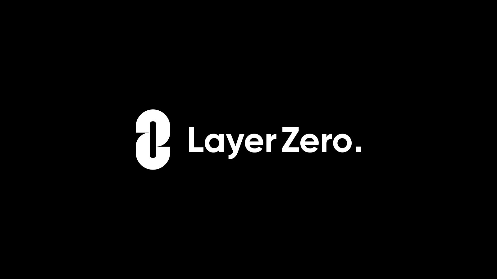

<div align="center">
    
</div>

---

# LayerZero V1 Solidity Examples


>[!IMPORTANT]
> **LayerZero V2** is now available [here](https://github.com/LayerZero-Labs/LayerZero-v2), offering improvements in cross-chain transaction speed, gas efficiency, and more. 
>
> Review the [LayerZero V2 Documentation](https://docs.layerzero.network/) for a comprehensive overview of the new feature set.
>
> For these reasons, we recommend deploying to LayerZero V2 instead of LayerZero V1.
>
> All of the contracts available in this repo should be considered legacy for Endpoint V1.


Welcome to the solidity-examples repository, showcasing various contract examples utilizing LayerZero. LayerZero is an Omnichain Interoperability Protocol, facilitating reliable, trustless communication between different blockchain networks.

**Disclaimer**: This repository contains example contracts to demonstrate the capabilities and usage of LayerZero. For actual implementation in your projects, it's recommended to use the official LayerZero contracts (such as LZApp, OFT, OFTV1.2, etc.) directly from the[ npm package](https://www.npmjs.com/package/@layerzerolabs/solidity-examples). 

You can find instructions for inheriting, deploying, and best practices for the provided contracts in the [LayerZero V1 Documentation](https://layerzero.gitbook.io/docs/layerzero-v1/introduction).

* Formal audit(s) (May 21, 2022) can be found in [audit](./audit)

### Install & Run tests

```shell
yarn install
yarn test
```

The code in the [contracts](./contracts) folder demonstrates LayerZero contract behaviours:

* [NonblockingLzApp](./contracts/lzApp/NonblockingLzApp.sol) provides a generic message passing interface to send and receive arbitrary pieces of data between contracts existing on different blockchain networks. Take a look at how `OmniCounter` inherits `NonblockingLzApp` to easily handle omnichain messaging.

* The [OFTV1](./contracts/token/oft/v1/OFT.sol) Standard allows ERC20 tokens to be transferred across multiple EVM-compatible blockchains without asset wrapping or middlechains.

* The [OFTV1.2](./contracts/token/oft/v2/OFTV2.sol) Standard allows fungible tokens to be transferred across both EVM and non-EVM compatible blockchains supported by LayerZero.

* The [ONFT721](./contracts/token/onft721/ONFT721.sol) Standard allows ERC721 NFTs to be moved across EVM chains.

* The [ONFT1155](./contracts/token/onft1155/ONFT1155.sol) Standard allows ERC1155 tokens to be sent to EVM chains.

**Notice**: Each of the above standards comes with a `Proxy` variant for sending tokens that have already been deployed cross-chain. 

> **There can only be one `Proxy` per deployment**.
> Multiple Proxies break omnichain unified liquidity by effectively creating token pools. If you create Proxies on multiple chains, you have no way to guarantee finality for token transfers due to the fact that the source chain has no knowledge of the destination pool's supply (or lack of supply). This can create race conditions where if a sent amount exceeds the available supply on the destination chain, those sent tokens will be permanently lost.

* Always audit your own code and test extensively on `testnet` before going to mainnet 🙏

> The examples below use two chains, however you could substitute any LayerZero supported chain! 

# OmniCounter.sol

OmniCounter is a simple example of `NonblockingLzApp` contract that increments a counter on multiple chains. You can only *remotely* increment the counter!

1. Deploy both OmniCounters:

```shell
npx hardhat --network bsc-testnet deploy --tags OmniCounter
npx hardhat --network fuji deploy --tags OmniCounter
````

2. Set the remote addresses, so each contract can receive messages

```shell
npx hardhat --network bsc-testnet setTrustedRemote --target-network fuji --contract OmniCounter
npx hardhat --network fuji setTrustedRemote --target-network bsc-testnet --contract OmniCounter
```

3. Send a cross chain message from `bsc-testnet` to `fuji` !

```shell
npx hardhat --network bsc-testnet incrementCounter --target-network fuji
```

Optionally use this command in a separate terminal to watch the counter increment in real-time.

```shell
npx hardhat --network fuji ocPoll
```

# Check your setTrustedRemote's are wired up correctly

Just use our [checkWireUpAll](./tasks/checkWireUpAll.js) task to check if your contracts are wired up correctly. You can use it on the example contracts deployed above.

1) UniversalONFT

```shell
npx hardhat checkWireUpAll --e testnet --contract ONFT721Mock
```

2) OmniCounter

```shell
npx hardhat checkWireUpAll --e testnet --contract OmniCounter
```

### See some examples in `/contracts`  🙌

Many of the example contracts make use of `LayerZeroEndpointMock.sol` which is a nice way to test LayerZero locally!

### For further reading, and a list of endpoint ids and deployed LayerZero contract addresses please take a look at the Gitbook here: https://layerzero.gitbook.io/

# OmnichainFungibleToken (OFT)

## About OFTV1.2

```text
NOTE: the OFTV1.2 uses uint64 to encode value transfer for compatability of Aptos and Solana. 

The deployer is expected to set a lower decimal points like 6 or 8. 

If the decimal point is 18, then uint64 can only represent approximately 18 tokens (uint64.max ~= 18 * 10^18).
```

## Deploy Setup

1. Add a `.env` file (to the root project directory) with your `MNEMONIC="your mnemonic"` and fund your wallet in order to deploy!
2. Follow any of the tutorials below

## OFTV2Mock.sol - an omnichain ERC20

:warning: **You must perform `setTrustedRemote()` (step 2). This is a mock deployment that auto mints tokens to `msg.sender`**

1. Deploy two contracts:

```shell
npx hardhat --network goerli deploy --tags ExampleOFTV2
npx hardhat --network fuji deploy --tags ExampleOFTV2
```

2. Set the "trusted remotes" (ie: your contracts) so each of them can receive messages from one another, and `only` one another.

```shell
npx hardhat --network goerli setTrustedRemote --target-network fuji --contract OFTV2Mock
npx hardhat --network fuji setTrustedRemote --target-network goerli --contract OFTV2Mock
```

3. Set the "minDstGas" required on the destination chain.

```shell
npx hardhat --network goerli setMinDstGas --packet-type 0 --target-network fuji --contract OFTV2Mock --min-gas 100000
npx hardhat --network fuji setMinDstGas --packet-type 0 --target-network goerli --contract OFTV2Mock --min-gas 100000
```

:warning: Although `100000` is used for `min-gas` in this example, you should set this value based on careful gas consumption analysis.

4. Send tokens from goerli to fuji

```shell
npx hardhat --network goerli oftv2Send --target-network fuji --qty 42 --contract OFTV2Mock
```

 **Pro-tip**: Check the ERC20 transactions tab of the destination chain block explorer and await your tokens!

# OmnichainNonFungibleToken721 (ONFT721)

This ONFT contract allows minting of `nftId`s on separate chains. To ensure two chains can not mint the same `nftId` each contract on each chain is only allowed to mint`nftIds` in certain ranges.
Check the `ONFT_ARGS` constant defined in ONFT721 deploy script for the specific test configuration used in this demo.

## ONFT721Mock.sol 

:warning: **You must perform the `setTrustedRemote()` (step 2).**

1. Deploy two contracts:

```shell
npx hardhat --network bsc-testnet deploy --tags ONFT721
npx hardhat --network fuji deploy --tags ONFT721
```

2. Set the "trusted remotes", so each contract can send & receive messages from one another, and **only** one another.

```shell
npx hardhat --network bsc-testnet setTrustedRemote --target-network fuji --contract ONFT721Mock
npx hardhat --network fuji setTrustedRemote --target-network bsc-testnet --contract ONFT721Mock
```

3. Set the min gas required on the destination

```shell
npx hardhat --network bsc-testnet setMinDstGas --target-network fuji --contract ONFT721Mock --packet-type 1 --min-gas 100000
npx hardhat --network fuji setMinDstGas --target-network bsc-testnet --contract ONFT721Mock --packet-type 1 --min-gas 100000
```

4. Mint an NFT on each chain!

```shell
npx hardhat --network bsc-testnet onftMint --contract ONFT721Mock --to-address <address> --token-id 1
npx hardhat --network fuji onftMint --contract ONFT721Mock --to-address <address> --token-id 11
```

5. [Optional] Show the token owner(s)

```shell
npx hardhat --network bsc-testnet ownerOf --token-id 1 --contract ONFT721Mock
npx hardhat --network fuji ownerOf --token-id 11 --contract ONFT721Mock
```
6. Send ONFT across chains

```shell
npx hardhat --network bsc-testnet onftSend --target-network fuji --token-id 1 --contract ONFT721Mock
npx hardhat --network fuji onftSend --target-network bsc-testnet --token-id 11 --contract ONFT721Mock 
```

7. Verify your token no longer exists in your wallet on the source chain & wait for it to reach the destination side.

```shell
npx hardhat --network bsc-testnet ownerOf --token-id 1 --contract ONFT721Mock
npx hardhat --network fuji ownerOf --token-id 1 --contract ONFT721Mock
```


# See testnet and mainnet chainIds and addresses, and the format for connecting contracts on different chains:

 https://github.com/LayerZero-Labs/set-trusted-remotes

 https://layerzero.gitbook.io/docs/technical-reference/testnet/testnet-addresses

 https://layerzero.gitbook.io/docs/technical-reference/mainnet/supported-chain-ids


## Most recently tested with node version `16.13.1` 

